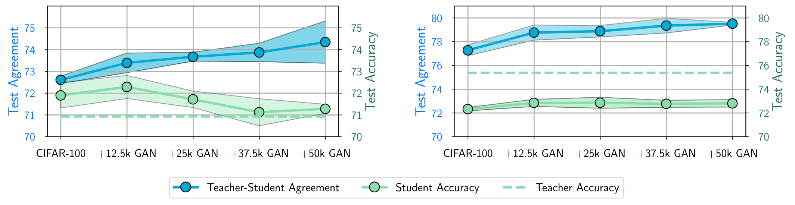
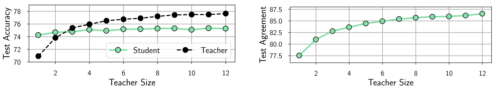
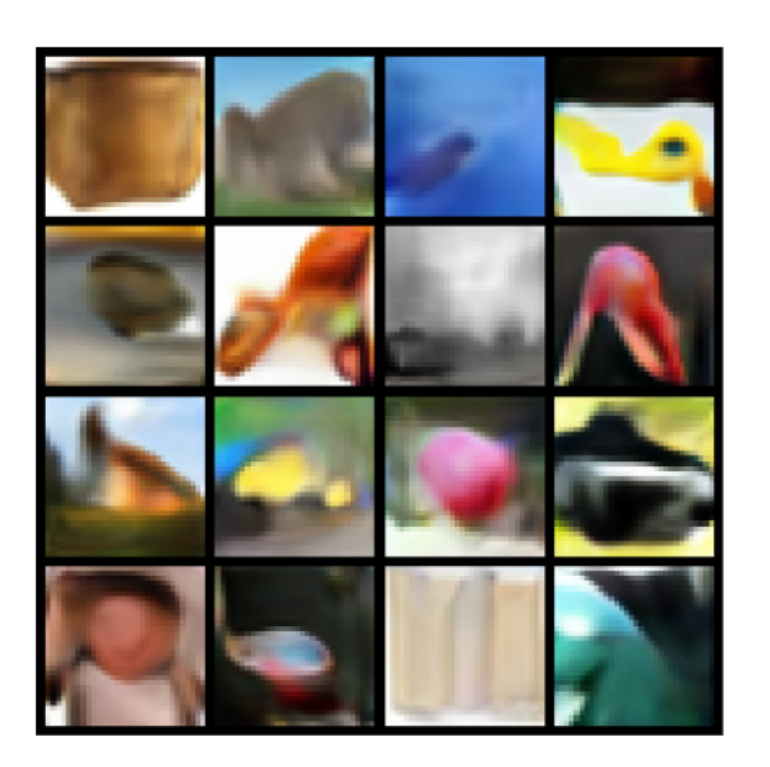
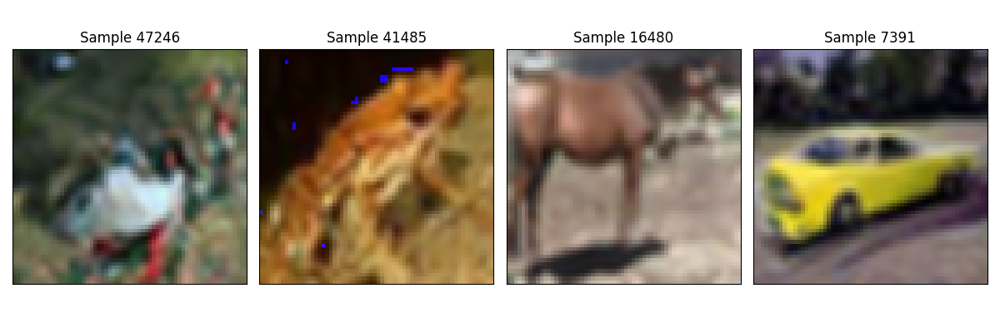

# CS 4782 Final Project

## Introduction
**Reimplementation Paper:** Does Knowledge Distillation Really Work? 

**Venue:** NeurIPS 2021

**Authors:** Samuel Stanton, Pavel Izmailov, Polina Kirichenko, Alexander A. Alemi, Andrew Gordon Wilson

In the paper, the authors examine some of the finer details of knowledge distillation and try to understand and explain when it works, how it works and what still remains challenging. First, they specify exactly what they mean by knowledge distillation where the loss is specified with respect to a teacher model $f_t$ and a student model $f_s$. Specifically, they define the knowledge distillation loss $$\mathcal{L}_{KD}(z_t,z_s) = -\tau^2\sum_{j=1}^c\sigma_j\left(\frac{z_t}{\tau}\right)\log\sigma_j\left(\frac{z_s}{\tau}\right)$$
While generically this loss function can be combined with negative log likelyhood loss for different knowledge distillation results, they focus only on this pure loss function to ensure that any effects are purely from the knowledge distillation. Additionally, the authors draw a distinction between generality (that is test accuracy) and fidelity which they define to be how well the student matches the teacher. The core argument of the paper is that while knowledge distillation helps to improve generality of the student model, fidelity remains extremely low. 

The authors use a variety of experiments to demonstrate that fidelity is low within the domain of image classification. The authors show that across different knowledge distillation domains (namely ensemble distillation and self-distillation) that fidelity remains low and that the reason is difficulty within optimization. To show this, the present a few different graphs that show how increasing the amount of data in the distillation dataset increases fidelity but its effects on generalization depend on the model size. In the case of self-distillation where the teacher and student model have the same architecture, more data actually decreases generalization. In the case where the teacher is an ensemble, increasing fidelity increases generalization. Additionally, the paper presents various hypotheses for why knowledge distillation seems to do a poor job of what it claims, getting the student to learn from the teacher. From a few different experiments they show that difficulty in optimization is the primary driver of low fidelity. 

## Chosen Result

I chose to reimplement 2 figures from the paper that contain 4 total graphs. In the first graph, a ResNet-56 model is self-distilled. The graph shows how as the amount of extra synthetic data is added that fidelity improves but test accuracy decreases. In the second graph, the same experiment is performed except the teacher is an ensemble of 3 ResNet-56 models. This graph shows how as more data is used in the distillation process both generalization and fidelity improves.

In the 3rd graph, student and teacher performance is graphed for different ensemble sizes of the teacher, from 1 to 12. In the 4th graph the fidelity between the teacher and student models is graphed against the size of the teacher.

These figures are important to the paper because they demonstrate the core problem addressed in the paper, that fidelity and generalization are distinct and show different behavior depending on the circumstances. This is essentially the core argument of the paper, that knowledge distillation works by increasing generalization but not by having the student match the teacher. Additionally, these figures rule out certain explanations like that the student is not expressive enough to match the teacher. In the self-distillation case this is clearly not true. Additionally, as the size of the ensemble increases, student teacher matching actually increases. These are all very interesting results that motivate the rest of the paper which is why I chose to reimplement them.

## Re-implementation Details
The one major change I made from the implementation of the paper to my re-implementation was changing the dataset from CIFAR-100 to CIFAR-10. The primary motivation for this change was that I was unable to generate GAN data for CIFAR-100. I tried 4 different implementation (including the one used in the paper) but the conda environments either failed to solve or did not work with the code. In the end I used a pretrained CIFAR-10 diffusion model from huggingface in order to generate the synthetic data. Specifically, I used [google/ddpm-cifar10-32](https://huggingface.co/google/ddpm-cifar10-32) The GAN data used for synthetic data in the paper looked like this

While the synthetic data that I generated looked like this

I used the same ResNet-56 architecture as was used in the paper which is a standard preresnet architecture originally sourced from [here](https://github.com/facebook/fb.resnet.torch) and [here](https://github.com/pytorch/vision/blob/master/torchvision/models/resnet.py). Additionally, I used the [CIFAR-10](https://www.cs.toronto.edu/~kriz/cifar.html) dataset from the University of Toronto. While the paper didn't specify the method of creating the ensemble. I trained $n$ ResNet-56 models and then averaged their probabilities to determine the final probability distribution. I used the KD loss described in the paper with a temperature of 1. For evaluation metric I measured the test agreement as the number of examples where the student and teacher predicted the same class on the test set and the typical metric of test accuracy.

The code is tested to run on Python3.10 with torch 2.2.0+cu121, diffusers 0.27.2

In order to run the code, you must first generate the synthetic data by running `generate_synthetic.py` then train all the ensembles and perform model distillation by running `resnet.py` finally, running `create_graphs.py` will create the visualizations.

The code is relatively lightweight and any GPU should be able to run the code. While it does take a while the memory requirements are low, only around 4GB of VRAM required to run on the GPU. While it is probably possible to run on the CPU, it will take a very long time as the code trains many ResNet models.

## Results and Analysis

## Conclusion and Future Work

One of the key lessons I learned from this implementation was how sensitive these models can be to hyperparameters. I found that the learning rate schedule has a significant impact on the quality of training. Early on I had some very unstable training runs and only once I ensured that all the hyperparameters were exactly as described in the paper was I able to make progress on re-implementing the results. It was also interesting to see the variety in the specificity of papers in describing their hyperparameters. In general this paper was quite detailed about the hyperparameters used which made is feasible to reimplement, however, I know most papers do not include that much detail.

Another thing that I learned was that old machine learning repositories are extremely hard to use. All of the CIFAR-100 repositories that I tried to use to generate data included requirements and instructions to build a conda environment that worked with the code but I was still unable to get any of them to work. 

While the paper briefly addresses how these issues persist across other domains and across different datasets. I found that with CIFAR-10 some of the core results of the paper (namely that fidelity and generalization didn't always correlate) didn't hold. It would be interesting to see what determines the necessary conditions for this to happen. Additionally, there is clearly room for future work to address how fidelity and generalization can be improved to further improve knowledge distillation.

## References

[Does Knowledge Distillation Really Work?](https://arxiv.org/abs/2106.05945)

[CIFAR-10](https://www.cs.toronto.edu/~kriz/cifar.html)

[Synthetic Data Generation](https://huggingface.co/google/ddpm-cifar10-32)

[ResNet-56](https://github.com/samuelstanton/gnosis/blob/main/gnosis/models/preresnet.py)